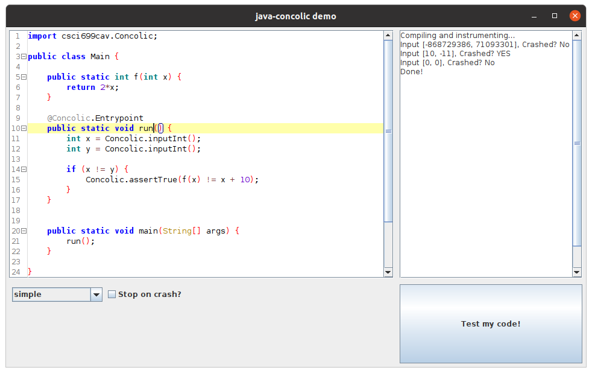

# java-concolic

This is an implementation of the concolic testing algorithm for Java leveraging Soot for program analysis/instrumentation and Z3 for constraint solving/simplification. It follows the fundamental algorithms out-lined in the DART and CUTE papers.

